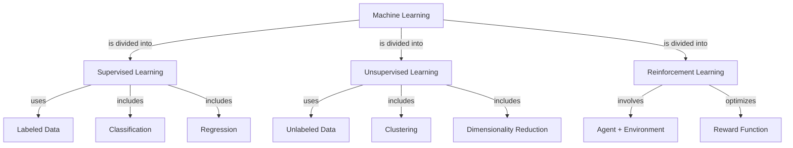

# Concept Map Creator

## Description
Generate a structured concept map for any topic, showing the central idea, major branches, sub-concepts, and the labeled relationships between them. Output in text-tree format and as a Mermaid diagram that can be rendered visually in any Markdown viewer.

## Why Hermes
Concept maps require understanding the hierarchical and relational structure of knowledge — not just listing facts but identifying how ideas connect and depend on each other. Hermes produces logically coherent maps where relationship labels are meaningful rather than generic ("leads to," "is a type of," "requires").

## Quickstart
```bash
python examples/education/learning_assistant.py concept-map --topic "Photosynthesis" --depth 3
```

## Sample Input
```
Topic: Machine Learning
Depth: 3 levels
```

## Output Format
```
CONCEPT MAP: Machine Learning
━━━━━━━━━━━━━━━━━━━━━━━━━━━━

TEXT TREE
Machine Learning
├── [is divided into] Supervised Learning
│   ├── [uses] Labeled Data
│   ├── [includes] Classification
│   │   └── [example algorithms] SVM, Decision Trees, Neural Networks
│   └── [includes] Regression
│       └── [example algorithms] Linear Regression, Ridge, Lasso
├── [is divided into] Unsupervised Learning
│   ├── [uses] Unlabeled Data
│   ├── [includes] Clustering
│   │   └── [example algorithms] K-Means, DBSCAN
│   └── [includes] Dimensionality Reduction
│       └── [example algorithms] PCA, t-SNE
└── [is divided into] Reinforcement Learning
    ├── [involves] Agent + Environment
    ├── [optimizes] Reward Function
    └── [example applications] Game AI, Robotics

MERMAID DIAGRAM


KEY RELATIONSHIPS SUMMARY
- Supervised vs. Unsupervised: distinguished primarily by whether training data is labeled
- All three paradigms share the goal of learning patterns from data
- Reinforcement Learning is unique in requiring an interactive environment rather than a static dataset
```

## Tips
- Use `--depth 2` for a high-level overview and `--depth 4` for detailed maps before exams.
- Copy the Mermaid block into any Markdown renderer (GitHub, Notion, Obsidian) for a visual diagram.
- Ask for a concept map before reading a textbook chapter to create a visual advance organizer.
- Combine with the flashcard generator to create cards for each node in the map.
